```{r xaringan-themer, include=FALSE, warning=FALSE}
#This block contains the theme configuration for the CSS lab slides style
library(xaringanthemer)
library(showtext)
style_mono_accent(
  base_color = "#5c5c5c",
  text_font_size = "1.5rem",
  header_font_google = google_font("Arial"),
  text_font_google   = google_font("Arial", "300", "300i"),
  code_font_google   = google_font("Fira Mono")
)
```

```{r setup, include=FALSE}
options(htmltools.dir.version = FALSE)
```


layout: true
<div class="my-footer"><span>David Garcia - Politics of Inequality Colloquium</span></div> 

---

background-image: url(figures/AboutUS.svg)
background-size: 98%

---

# Our Research Topics

---

background-image: url(figures/VennV2-1.svg)
background-size: 97%
---
background-image: url(figures/VennV2.svg)
background-size: 97%

---

# Summary

## 1. Computational Social Science and Inequality

## 2. Measuring Ontologies of Truth from Text

## 3. Populism and polarization in the US congress

---

background-image: url(figures/FGD.svg)
background-size: 98%
---

# CSS and the Politics of Inequality

.pull-left[.center[]]

.pull-right[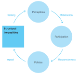]


<p style="font-family: times, serif; font-size:20pt; font-style:italic">
<a href=https://doi.org/10.2760/709177>  Technology and Democracy: Understanding the influence of online technologies on political behaviour and decision-making. Lewandowsky et al (2020)</a>
</p>
---


# CSS and the Politics of Inequality

.pull-left[.center[]]
.pull-right[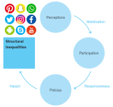]


<p style="font-family: times, serif; font-size:20pt; font-style:italic">
<a href=https://psyarxiv.com/cxa9u>  Social drivers and algorithmic mechanisms on digital media. Hannah Metzler, David Garcia. Psyarxiv preprint (2022)</a>
</p>

---


# CSS and the Politics of Inequality

.pull-left[.center[]]

.pull-right[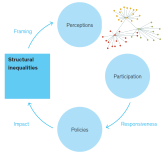]

<p style="font-family: times, serif; font-size:20pt; font-style:italic">

<a href=https://onlinelibrary.wiley.com/doi/epdf/10.1002/poi3.82>Ideological and Temporal Components of Network Polarization in Online Political Participatory Media. Garcia et al, Policy & Internet (2015)</a>

</br>
<a href=https://epjdatascience.springeropen.com/articles/10.1140/epjds/s13688-015-0042-4>Sentiment cascades in the 15M movement. Alvarez, Garcia, Moreno & Schweitzer, EPJ Data Science (2015)</a>
</p>
---


# CSS and the Politics of Inequality

.pull-left[
Analysis of parliamentary speeches and other political documents
- E.g. relationship between social language and approval

- Several datasets available: US, UK, German, Hungary...

- Today's example: analysis of populism language in the US parliament and its relationship to polarization
]
.pull-right[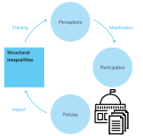]


---
# CSS and the Politics of Inequality

.pull-left[
Social media as *ad hoc publics* with citizens, politicians, and media

- Agenda setting: Previous work shows how average users lead media and politicians on Twitter

- Twitter data available for politicians in the UK, US, DE. Other platforms such as Reddit, Der Standard, public FB groups (crowdtangle)

- Today's example: Language of honesty in Twitter politicians

]
.pull-right[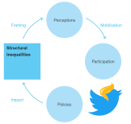]


---

# Measuring Ontologies of Truth from Text

## 1. Computational Social Science and Inequality

## *2. Measuring Ontologies of Truth from Text*

## 3. Populism and polarization in the US

---

# Honesty and truth in politics

>  I don't think I'll do research on Fake News (Garcia, 2016)
--


.center[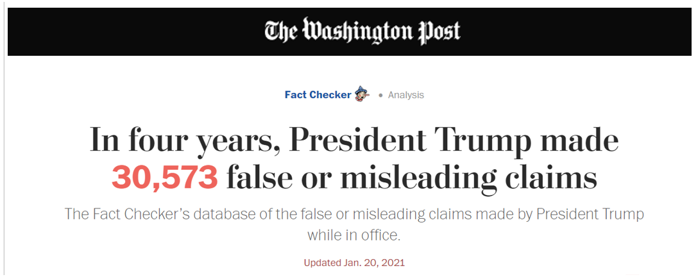]

## Repeated polling showed 3/4 of Republicans considered Trump to be honest
---

# Populism and Truth 

Populism defined as a political communication portraying a  Manichaen binary conflict between virtuous "people" and "elite" (or "others")
  - *Why populism is troubling for democratic communication, Silvio Waisbord, Communication Culture & Critique (2018)*
  - can be an entirely artificial construction and be reshaped as needed
  - negates pluralism and goes against democratic principles
  
Corollary is the affirmation of "common sense" of people against "lies" of elites
  > Just remember, what you're seeing and what you’re reading is not what's happening (U.S. President Donald Trump, 24 July 2018)

---

# Post post-truth

> The result of a consistent and total substitution of lies for factual truth is not that the lies will now be accepted as truth, and the truth be defamed as lies, but that the sense by which we take our bearings in the real world—and the category of truth vs. falsehood is among the mental means to this end—is being destroyed (Hannah Arendt, 1967).

- **Deliberate lies**: Carefully constructed fabrications or obfuscations intended to protect and promote material or ideological interests with a coherent agenda
  - WMDs in Irak as an example. Focus of fake news research
- **Shock and chaos**
  - Regime of falsehoods that seems to have given up on the notion of a shared reality and instead relies on an extreme form of constructivism in which "truth" is entirely in the eye of the beholder
  - Trump's incoherent lies as an example


---

# Two ontologies of truth

*Hannah Arendt and the contemporary social construction of conspiracy theorists. Stephan Lewandowsky (2020)*

.pull-left[ 
- **Truth and honesty in a democracy** 
  - relies on evidence
  - veracity is key
  - truth seeking is the goal
]

.pull-right[
- **Populist honesty and truth**
  - relies on authenticity
  - intuition and feelings are relevant
  - belief speaking is key
]

- Can we identify those different "truths" in political speech?  
- If so, how do the components relate to accuracy of (shared) information?

We want to go beyond *post-truth* and study the two ontologies over the last two centuries but at the timescale of social media as well

---

background-image: url(figures/PRODEMINFO.svg)
background-size: 98%

---
background-image: url(figures/DDR.svg)
background-size: 98%
---

## Previous application to honesty on Twitter

.center[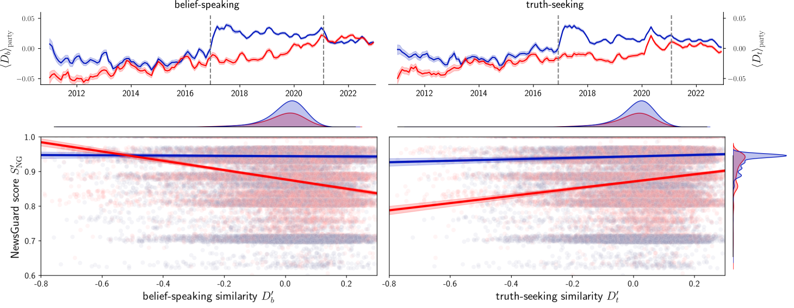]
[From alternative conceptions of honesty to alternative facts in communications by U.S. politicians
J. Lasser, S. Aroyehun, F. Carrella, A. Simchon, D. Garcia, S. Lewandowsky (Preprint)](https://arxiv.org/abs/2208.10814)

---

## Belief-speaking and truth-seeking dictionaries

1. Starting with a basic list of words for the ends of the truth-populism spectrum
  - Truth-seeking words: reality, examine, evidence, fact, proof...
  - Belief-speaking words: believe, feel, intuition, "common sense"...

2. Expanding word lists with Fastext and LEXpander (colexification networks)

3. Cleaning word lists with crowdsourced ratings. Result: 49 truth, 35 belief
.center[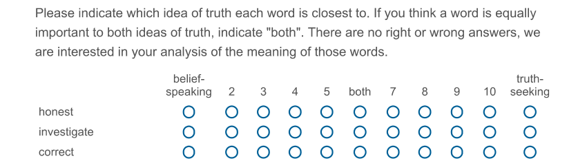]

---

# Annotating truth and populism in text

- Crowdsourced annotation of tweets by politicians
  - Random sample (N=300) stratified by similarity with dictionaries
  - Second sample: 15 random tweets from 10 republicans and 10 democrats
- 175 raters from the US recruited through Prolific
- Minimum of 5 ratings per tweet
.center[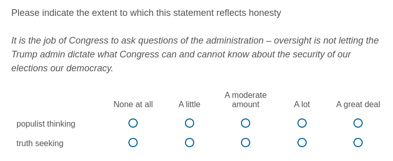]

---

## Validation of unsupervised truth-populism score

- Truth and populism ratings are correlated: $\rho=-0.49$ $[-0.55,-0.43]$

- Truth-populism as a rating has the highest $ICC= 0.52$ $[0.49,0.56]$

- **Ground truth:** difference between mean truth rating and mean populism rating

- **Unsupervised estimation:** For each tweet, we calculate a truth-populism as the difference between the Z-scored DDR similarities with the truth and with the populism dictionaries

  - Correlation for random tweets: $r_{rnd}= 0.599$, $[0.521,0.668], p<0.001$
  - Correlation for politician means: $r_{pol}=0.449$, $[0.008, 0.744], p=0.047$

---

# Error analysis and propagation
.pull-left[]
.pull-right[- Normally distributed residuals
- Low heteroskedasticity
- sd of residuals: 0.8
- sd of truth-populism ratings: 1
- higher sd for politicians sample (0.88 residuals vs 1.06 ratings) 
- Similar for both parties:
  - 0.87 (Dem) 0.89 (Rep)
]
- Error propagation in statistical analysis:
- When computing the mean truth-populism rating of a sample:
  - 10000 bootstrap samples with replacement 
  - To each element in each sample: add $N(\mu=0, \sigma^2=0.8^2)$ error

---

# Populism and polarization in the US

## 1. Computational Social Science and Inequality

## 2. Measuring Ontologies of Truth from Text

## *3. Populism and polarization in the US*

---

## Long and fast dynamics in two timescales

**US Congress speech transcripts**
- Analysis at the sentence level: each sentence has a score
- 84,568,012 sentences (1873-2022)
- We use DW-NOMINATE polarization estimator (voteview) as mean polarization of House and Senate
- [J. Lewis, K. Poole, H. Rosenthal, A. Boche, A. Rudkin, and L. Sonnet (2023). Voteview: Congressional Roll-Call Votes Database.](https://voteview.com/)

**Twitter US politicians data**
- Dataset on US Congress members (114th-118th)
- 1278 users, 220 unavailable due to deletion or private accounts
- Total tweets: 5,914,107. After removing RT, non-text, duplicates: 3,897,032 
- Accounts matched to individual candidates and parties
---

.center[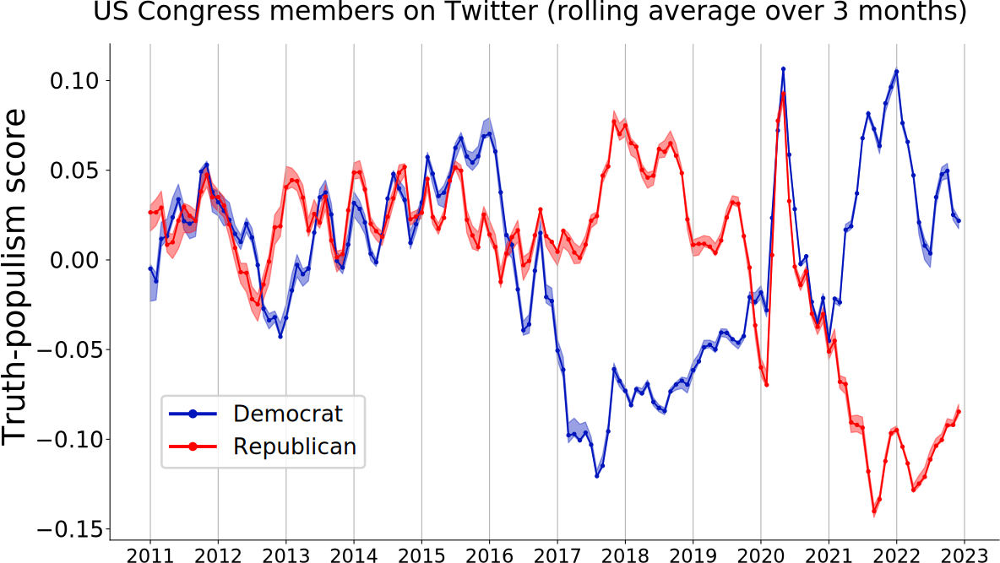]
---

.center[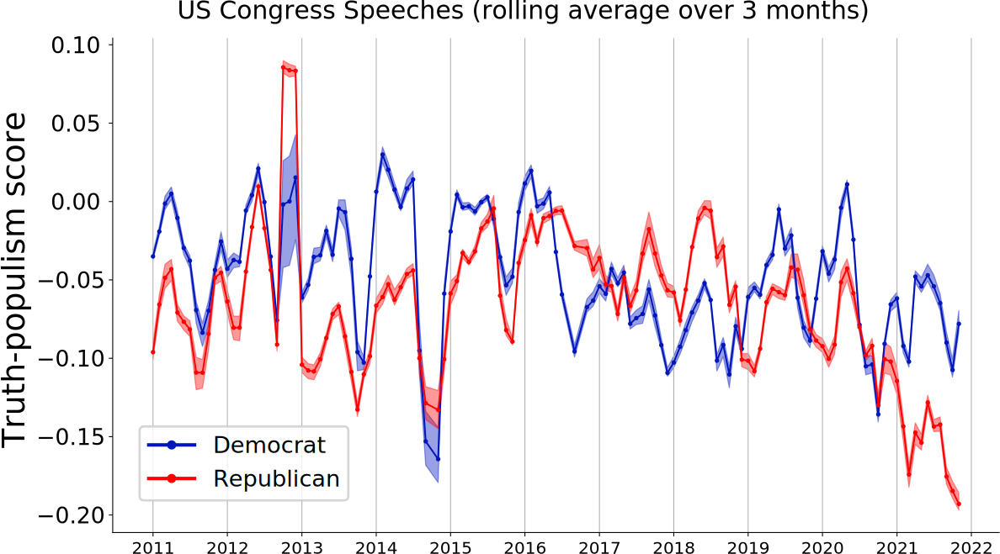]
---

.center[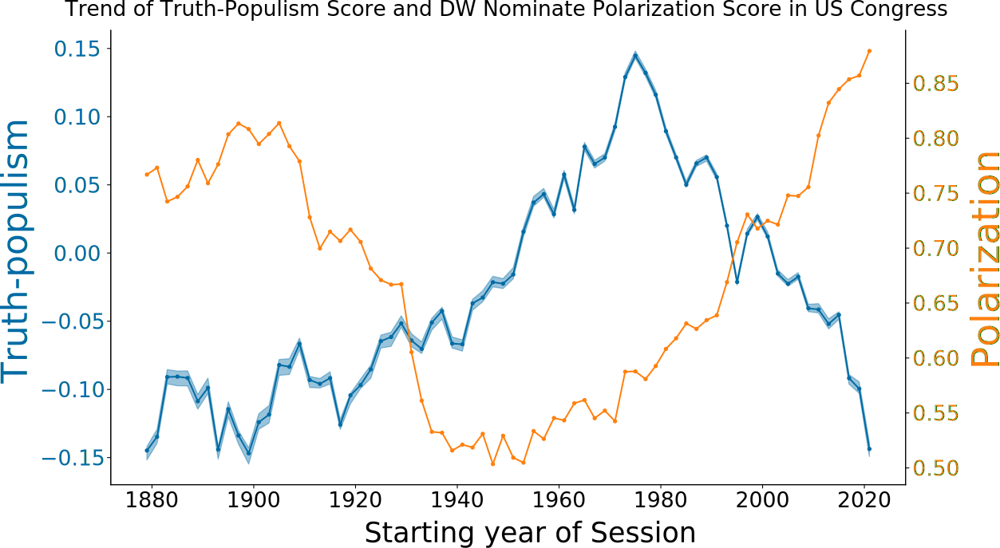]
---

## Polarization and populism

.center[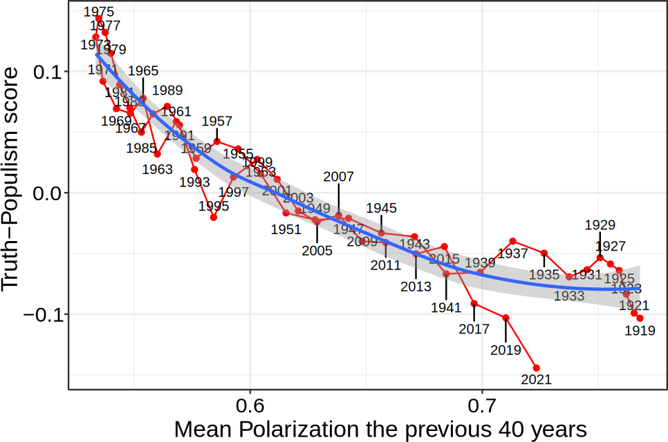]
---

# Summary

- **Populism and ontologies of truth**
  - Beyond misinformation: truth-seeking versus belief-speaking
  - New populism: Shock and chaos versus deliberate lies


- **Text analysis to detect honesty components related to populism**
  - Distributed Dictionary Representations to smooth dictionaries
  - Validated word lists and document-level metric
  - Error measurement and propagation into statistical analysis


- **Application to US Congress and Twitter politicians**
  - Spike of truth-seeking during pandemic
  - Switching language between ruling party and opposition
  - Republicans in all-time low since 2010s
  - Polarization seems to lead populism

---

# Next steps and work to do

- **Dealing with congress vacation**
  - How to deal with months when a congress is not in session but Twitter is?
- **Validation in congress text + UK**
  - Need to annotate congress sentences. Can we use Prolific?
  - Any issues of temporal validity? Are there periods to sample?
- **How to continue considering error in measurement?**
- **Application to average Twitter users**
  - Recently finished survey answering ontology of truth questionnaire
- **Hammer looking for nails**
  - Do you have research questions we can address with these methods?
  - How can we apply this to study inequality?

.center[**More at: [www.dgarcia.eu](https://dgarcia.eu) and [@dgarcia_eu](https://twitter.com/dgarcia_eu)**  

**Thanks for listening!**
]

